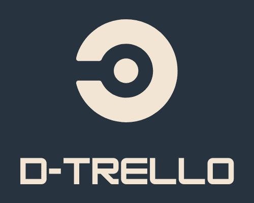
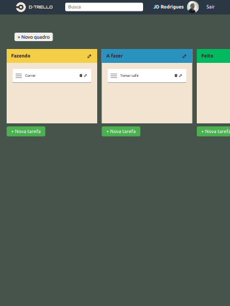
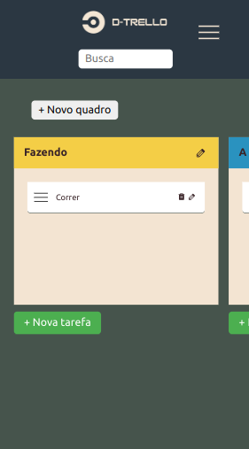

  

## 📋 Descrição: 

d-Trello é um aplicativo de gerenciamento de projeto baseado na web e utiliza o paradigma Kanban de gerenciamento.

🟢 **Live do projeto:** <a href="https://d-trello-front.onrender.com/">clique aqui.</a> 

 

| tablet   | smartphone |
|----------|:---------|
|  |  | 

<!-- 

  

  

 -->

## 🎯 Objetivo:
Este aplicativo é resultado de minha busca por ser um profissional mais completo. Como desenvolvedor front-end, estive buscando dominar o essencial de back-end e dando passos iniciais em direção ao full-stack. Vi nesse tipo de aplicação uma oportunidade de ter um aprendizado prático e, ao mesmo tempo, desenvolver algo útil, critério que tem guiado minha jornada no desenvolvimento web.

## 🛠️ Funcionalidades:
- Login com conta Google.
- Criação, edição e remoção de quadros e tarefas.
- É possível arrastar e soltar quadros e tarefas, a fim de reordená-los, bem como passar tarefas de um quadro para outro.
- Cada usuário tem seu próprio espaço; as atividades e conteúdos são persistidos e recuperados nos acessos posteriores.
- Busca de tarefas.
- Scroll lateral automático após a criação de quadros, levando até o quadro criado, quando a lista de quadros excede a largura da tela. O mesmo se dá dentro de cada quadro, verticalmente,  ao criar tarefas.
- Responsivo.
  
## 🔭 Tecnologias utilizadas:
- **Html, CSS e Javascript** - linguagens puras utilizadas na criação do front-end.
- **NodeJs** - usado para o desenvolvimento do back-end com Javascript.
- **Express JS** - utilizado na criação do servidor e da API.
- **MySQL** - armazenamento de usuários, quadros e tarefas.
- **Fetch API** - utilizada nas requisições ao servidor Express.
- **JKanban** - plugin Javascript utilizado na criação de quadros e tarefas no front-end.
- **Dragula** - plugin Javascript utilizado na implementação das ações de arrastar e soltar componentes na tela.
- **Sweet Alert 2** - biblioteca Javascript utilizada na criação de alertas e modais em diversos momentos da experiência do usuário, como, por exemplo:
  - em modais de criação de quadros;
  - para validação nas ações de remoção e criação de quadros e tarefas;
  - na confirmação da remoção de quadros e tarefas;
  - nos modais de carregamento exibidos entre a criação e a renderização dos conteúdos.
- **Mysql2** - biblioteca Node utilizada para a conexão com o banco de dados MySql.
- **API de autenticação do Google** - utilizada para o login de usuário.
- **JWT Decode** - biblioteca utilizada para decodificar o token JWT contendo as informações do usuário recebidas do Google após a autenticação.
- **Cors** - biblioteca utilizada junto ao Express para gerenciar permissões de compartilhamento de conteúdo com clientes de origens diversas.
- **Phosphor icons** - biblioteca de ícones.
- **Fonte Ubuntu** - fonte utilizada em toda a aplicação.
- **Render** - hospedagem para os códigos do front e back-end.
- **Railway** - hospedagem do banco de dados.

## 🟡 Status do projeto:
Já em funcionamento, mas em fase de refatoração.
